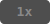

# Claude Code Statusline — 2x 用量加倍指示器

在 Claude Code 的 statusline 上即時顯示你是否在 **2 倍用量**的時段。

**活動期間：** 2026 年 3 月 13 日 ~ 3 月 27 日（[Anthropic 官方公告](https://support.anthropic.com/en/articles/11360-claude-march-2026-usage-promotion)）

## 顯示效果

| 狀態 | 顏色 | 時段 |
|------|------|------|
| 2x |  | 離峰（用量加倍） |
| 1x |  | 尖峰（正常用量） |
| 2x ended |  | 活動結束（僅 3/28，3/29 起自動消失） |

## 時區對照

活動在 **EDT 8AM–2PM（UTC 12:00–18:00）** 為尖峰，其餘時段用量加倍。

此活動全程在美國夏令時間（EDT）期間內，不受 DST 切換影響。

| 時區 | 離峰（2x） | 尖峰（1x） |
|------|-----------|-----------|
| UTC | 18:00 – 隔天 12:00 | 12:00 – 18:00 |
| 台灣 (UTC+8) | 凌晨 2:00 – 晚上 8:00 | 晚上 8:00 – 凌晨 2:00 |

> 備註：離峰加倍的用量**不會**計入你的 7 天週用量上限。

## 安裝方式

### 方式一：直接貼到你的 statusline.sh

最簡單的方式，把以下程式碼貼到你的 `statusline.sh` 中想顯示的位置：

```bash
# 2x Promotion (2026-03-13 ~ 2026-03-27)
PROMO_END="2026-03-28"
PROMO_GONE="2026-03-29"
TODAY_DATE=$(date '+%Y-%m-%d')
if [[ "$TODAY_DATE" < "$PROMO_GONE" ]]; then
    UTC_HOUR=$(date -u '+%H')
    UTC_HOUR_INT=$((10#$UTC_HOUR))
    if [[ "$TODAY_DATE" < "$PROMO_END" ]]; then
        if [ "$UTC_HOUR_INT" -ge 12 ] && [ "$UTC_HOUR_INT" -lt 18 ]; then
            PROMO_LABEL="\033[38;5;245;48;5;239m 1x \033[0m"
        else
            PROMO_LABEL="\033[38;5;232;48;5;173m 2x \033[0m"
        fi
    else
        PROMO_LABEL="\033[38;5;255;48;5;124m 2x ended \033[0m"
    fi
fi
```

然後在你的 `echo` 輸出中加入 `$PROMO_LABEL` 即可。不依賴任何框架或函式。

### 方式二：叫 AI 幫你裝

如果你用 Claude Code 或其他 AI 程式碼助手，直接說：

> 讀取 https://github.com/darrell-tw-martech/claudecode-statusline/blob/main/promotion-2026-spring/promotion.sh 然後幫我加到 statusline.sh

程式碼完整且有註解，任何 AI 都能直接整合。

### 方式三：自動安裝（Powerline 風格）

如果你的 statusline 使用 `pl_add` 函式（Powerline 色塊風格）：

```bash
git clone https://github.com/darrell-tw-martech/claudecode-statusline.git
cd claudecode-statusline/promotion-2026-spring
bash install.sh
```

腳本會自動偵測 `~/.claude/statusline.sh`、建立備份、插入 segment。

## 需求

- Claude Code 並已啟用自訂 statusline（`~/.claude/statusline.sh`）
- Bash 3.2+（macOS 內建即可）

## 運作原理

腳本用 UTC 小時判斷尖峰/離峰：

```
UTC 12:00-18:00 = EDT 8AM-2PM = 尖峰 (1x)
其餘時段 = 離峰 (2x)
```

日期檢查確保 segment 只在活動期間（3/13–3/27）顯示，3/28 顯示「ended」提醒一天，3/29 起完全消失。

## License

[MIT](./LICENSE)

---

Made by Darrell Wang · [Threads @darrell_tw_](https://www.threads.net/@darrell_tw_)
