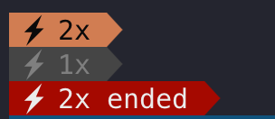

# ⚡ Claude Code Statusline — 2x 用量加倍指示器

在 Claude Code 的 statusline 上即時顯示你是否在 **2 倍用量**的時段。

**活動期間：** 2026 年 3 月 13 日 ~ 3 月 27 日（[Anthropic 官方公告](https://support.anthropic.com/en/articles/11360-claude-march-2026-usage-promotion)）

## 顯示效果

| 狀態 | 顯示 | 時段 |
|------|------|------|
| **離峰（用量加倍）** | `⚡2x` 橘棕底黑字 | EDT 8AM–2PM 以外 |
| **尖峰（正常用量）** | `⚡1x` 深灰底灰字 | EDT 8AM–2PM |
| **活動結束** | `⚡2x ended` 紅底白字 | 僅 3/28 當天 |

3/29 起自動消失，不需手動移除。



## 時區對照

活動在 **EDT 8AM–2PM（UTC 12:00–18:00）** 為尖峰，其餘時段用量加倍。

| 時區 | 離峰（2x） | 尖峰（1x） |
|------|-----------|-----------|
| UTC | 18:00 – 隔天 12:00 | 12:00 – 18:00 |
| 台灣 (UTC+8) | 凌晨 2:00 – 晚上 8:00 | 晚上 8:00 – 凌晨 2:00 |

> 備註：離峰加倍的用量**不會**計入你的 7 天週用量上限。

## 安裝方式

### 方式一：自動安裝

```bash
git clone https://github.com/darrell-tw-martech/claudecode-statusline.git
cd claudecode-statusline/promotion-2026-spring
bash install.sh
```

腳本會自動：
- 偵測你的 `~/.claude/statusline.sh`
- 建立備份
- 插入 promotion segment

### 方式二：手動貼上

把 [`promotion.sh`](./promotion.sh) 的內容貼到你的 `statusline.sh` 中，放在你想顯示的位置。

使用 `pl_add` 函式：

```bash
# pl_add <行號> <背景色_256> <前景色_256> <文字>
pl_add 1 173 232 "⚡2x"        # 橘棕底黑字
pl_add 1 239 245 "⚡1x"        # 深灰底灰字
pl_add 1 124 255 "⚡2x ended"  # 紅底白字
```

如果你的 statusline 沒有 `pl_add`，可以直接用 ANSI 色碼：
- 離峰：`\033[38;5;232;48;5;173m ⚡2x \033[0m`
- 尖峰：`\033[38;5;245;48;5;239m ⚡1x \033[0m`
- 結束：`\033[38;5;255;48;5;124m ⚡2x ended \033[0m`

### 方式三：叫 AI 幫你裝

如果你用 Claude Code 或其他 AI 程式碼助手，直接說：

> 讀取 https://github.com/darrell-tw-martech/claudecode-statusline/blob/main/promotion-2026-spring/promotion.sh 然後幫我加到 statusline.sh

程式碼完整且有註解，任何 AI 都能直接整合。

## 需求

- Claude Code 並已啟用自訂 statusline（`~/.claude/statusline.sh`）
- Bash 3.2+（macOS 內建即可）
- Powerline 風格的 statusline 搭配 `pl_add` 函式（或自行改用 ANSI 色碼）

## 運作原理

腳本用 UTC 小時判斷尖峰/離峰：

```
UTC 12:00–18:00 = EDT 8AM–2PM = 尖峰 (1x)
其餘時段 = 離峰 (2x)
```

日期檢查確保 segment 只在活動期間（3/13–3/27）顯示，3/28 顯示「ended」提醒一天，3/29 起完全消失。

## License

[MIT](./LICENSE)

---

Made by Darrell Wang · [Threads @darrell_tw_](https://www.threads.net/@darrell_tw_)
