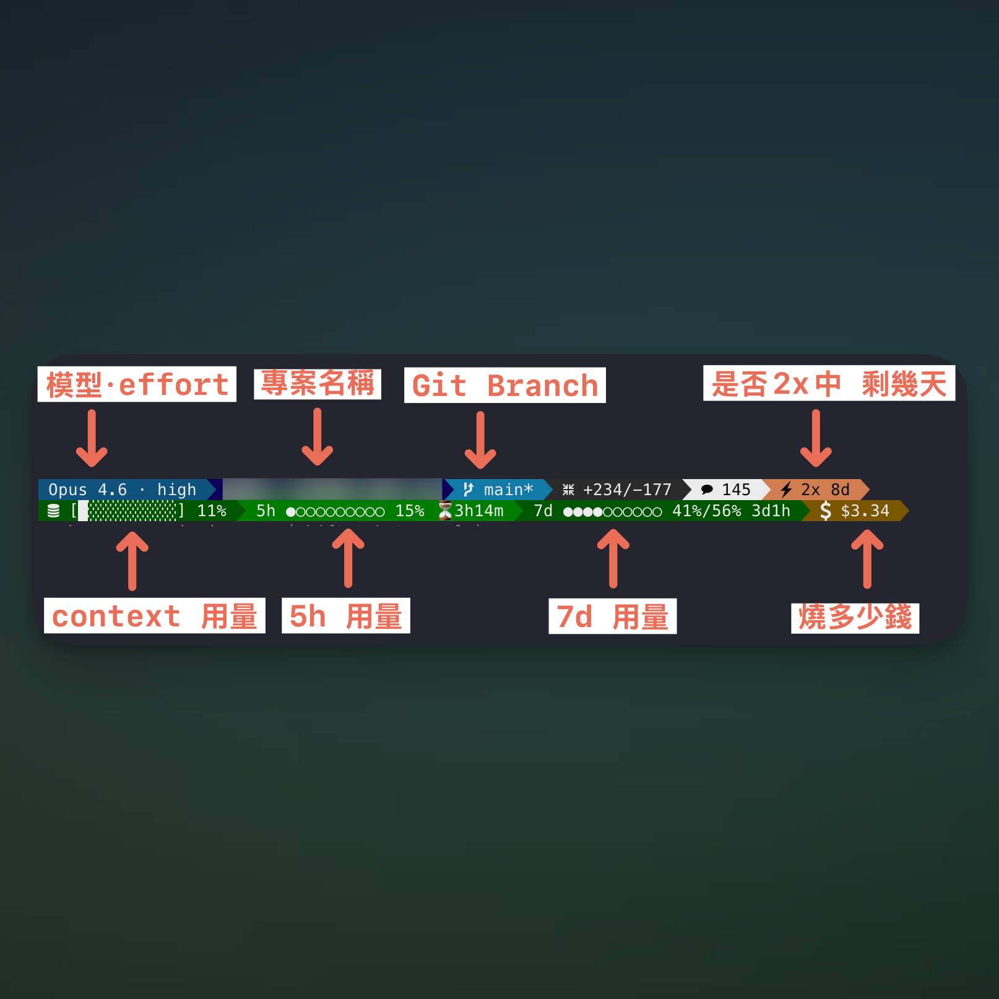

# Claude Code Powerline Statusline

A full-featured, two-line Powerline statusline for [Claude Code](https://claude.ai/code). Shows model info, git status, context usage, rate limits, session cost, and more — all in colored Powerline segments.

<!-- TODO: add screenshot here -->
<!--  -->

## Quick Start

```bash
git clone https://github.com/darrell-tw-martech/claudecode-statusline.git
cd claudecode-statusline/statusline
./install.sh
```

Or manually:

```bash
cp statusline.sh ~/.claude/statusline.sh
chmod +x ~/.claude/statusline.sh
```

Add to `~/.claude/settings.json`:

```json
{
  "statusLine": {
    "type": "command",
    "command": "~/.claude/statusline.sh"
  }
}
```

Restart Claude Code. The statusline appears after the first assistant response.

## Requirements

- **Claude Code 2.1.80+** (for `rate_limits` field in stdin JSON)
- **jq** — JSON parser (`brew install jq` / `apt install jq`)
- **bash** 4+ (macOS ships with 3.2 but it works; bash 4+ recommended)
- **git** — optional, for branch/commit modules
- **bc** — optional, for 7-day pacing calculation

## What It Looks Like

Two Powerline lines:

```
 Opus · high  project  main*  +10/-3  3  42  ⚡2x 8d  15m
 [██▍░░░░░░░] 15%  5h ●○○○○○○○○○ 10% ⏳3h22m  7d ●●●●○○○○○○ 41%/56% 3d1h  $0.50
```

**Line 1** (left to right):
| Segment | Example | Source |
|---------|---------|--------|
| Model + Effort | `Opus · high` | `model.display_name` + transcript/settings |
| Directory | `project` | `workspace.current_dir` |
| Project type | `JS` | file detection (package.json etc.) |
| Git branch | ` main*` | `git branch --show-current` |
| Lines changed | `+10/-3` | `cost.total_lines_added/removed` |
| Today's commits | `3` | `git log --since=today` |
| Message count | `42` | transcript JSONL line count |
| Promo | `⚡2x 8d` | [seasonal] time-based calculation |
| Work time | `15m` | transcript file mtime |

**Line 2** (left to right):
| Segment | Example | Source |
|---------|---------|--------|
| Context bar | `[██▍░░░░░░░] 15%` | `context_window.used_percentage` |
| 5h quota | `5h ●○○○○○○○○○ 10% ⏳3h22m` | `rate_limits.five_hour` |
| 7d quota | `7d ●●●●○○○○○○ 41%/56% 3d1h` | `rate_limits.seven_day` |
| Session cost | `$0.50` | `cost.total_cost_usd` |

## Modules

The script is organized into labeled modules. Search `══ MODULE:` in `statusline.sh` to find each one.

| Module | Lines | Needs | What it does |
|--------|-------|-------|-------------|
| **CORE** | ~90 | — | JSON parse, `pl_add`, `pl_render`, `mini_bar`. Required by all. |
| **git-info** | ~15 | CORE | Branch name, dirty indicator `*`, today's commit count |
| **work-time** | ~20 | CORE | Session duration from transcript file mtime |
| **project-type** | ~10 | CORE | Detect JS/PY/RS/GO from config files |
| **msg-count** | ~8 | CORE | Message count from transcript JSONL |
| **context-bar** | ~3 | CORE | Context window `used_percentage` extraction |
| **lines-changed** | ~3 | CORE | `+added/-removed` from cost data |
| **session-cost** | ~3 | CORE | Session cost in USD |
| **rate-limits** | ~40 | CORE, `mini_bar` | 5h/7d quota bars with reset countdown + 7d pacing |
| **effort** | ~10 | CORE | Thinking effort from transcript or settings |
| **promo** | ~65 | CORE, `pl_add` | [SEASONAL] 2x off-peak tracker. Safe to delete after expiry. |

### Removing a module

1. Find the `══ MODULE: <name> ══` header
2. Delete from that header to the next `══ MODULE:` or `══ ASSEMBLY:` header
3. In the ASSEMBLY section, remove the corresponding `pl_add` call

### Adding your own module

1. Add a new `══ MODULE:` block before the ASSEMBLY section
2. Read data from `$JSON` (stdin) or external commands
3. Store the display text in a variable
4. Add `pl_add <line> <bg> <fg> "$YOUR_VAR"` in the ASSEMBLY section

## Stdin JSON Reference

Claude Code pipes this JSON to your statusline script via stdin after each assistant response. Tested on 2.1.80.

### Full schema

```json
{
  "session_id": "abc123",
  "transcript_path": "/path/to/transcript.jsonl",
  "cwd": "/current/working/directory",
  "model": {
    "id": "claude-opus-4-6[1m]",
    "display_name": "Opus 4.6 (1M context)"
  },
  "workspace": {
    "current_dir": "/current/working/directory",
    "project_dir": "/original/project/directory",
    "added_dirs": []
  },
  "version": "2.1.80",
  "output_style": { "name": "default" },
  "cost": {
    "total_cost_usd": 0.50,
    "total_duration_ms": 120000,
    "total_api_duration_ms": 45000,
    "total_lines_added": 10,
    "total_lines_removed": 3
  },
  "context_window": {
    "total_input_tokens": 15000,
    "total_output_tokens": 5000,
    "context_window_size": 1000000,
    "current_usage": {
      "input_tokens": 1,
      "output_tokens": 148,
      "cache_creation_input_tokens": 312,
      "cache_read_input_tokens": 109405
    },
    "used_percentage": 11,
    "remaining_percentage": 89
  },
  "exceeds_200k_tokens": false,
  "rate_limits": {
    "five_hour": {
      "used_percentage": 10,
      "resets_at": 1773993600
    },
    "seven_day": {
      "used_percentage": 41,
      "resets_at": 1774245600
    }
  }
}
```

### Field notes

| Field | Notes |
|-------|-------|
| `rate_limits` | **2.1.80+**. Not present before the first API call. `resets_at` is Unix epoch (seconds). |
| `context_window.used_percentage` | Input tokens only (excludes output). May be `null` early in session. |
| `cost.total_cost_usd` | Cumulative for the session. Resets when session ends. |
| `vim.mode` | Only present when vim mode is enabled. Values: `NORMAL`, `INSERT`. |
| `agent.name` | Only present when running with `--agent` flag. |
| `worktree.*` | Only present during `--worktree` sessions. |

### Fields NOT in stdin (as of 2.1.80)

These are commonly requested but not available in the statusline JSON:

- **Permission mode** (bypass/default/plan) — rendered by Claude Code UI directly
- **Sonnet quota** (`seven_day_sonnet`) — only available via OAuth API endpoint
- **Extra usage credits** (`extra_usage`) — only available via OAuth API endpoint

## Powerline Rendering

The `pl_add` / `pl_render` system uses 256-color terminal codes:

```bash
pl_add <line> <bg_color> <fg_color> <text>
```

- `line`: `1` for top line, `2` for bottom line
- Colors: 256-color codes (e.g., 24=deep blue, 173=orange, 255=white)
- `pl_render` joins segments with Powerline arrow `` separators
- Segment colors automatically chain: each arrow transitions from current bg to next bg

### Color reference (used in this statusline)

| Code | Color | Used for |
|------|-------|----------|
| 24 | Deep blue | Model |
| 17 | Dark blue | Directory |
| 60 | Slate | Project type |
| 31 | Teal | Git branch |
| 236 | Dark gray | Lines changed |
| 255 | White | Light segments |
| 253 | Light gray | Light segments (alternating) |
| 173 | Orange | Promo 2x |
| 239 | Muted gray | Promo 1x |
| 22 | Green | Context <50%, 7d quota <50% |
| 136 | Yellow | Context 50-79% |
| 124 | Red | Context ≥80% |
| 28 | Green | 5h quota <50% |
| 130 | Yellow | 5h/7d quota 50-69% |
| 160 | Red | 5h quota ≥70% |
| 196 | Bright red | 7d quota ≥70% |
| 94 | Brown | Session cost |

## For AI Assistants

If a user asks you to set up or customize this statusline, follow this workflow:

1. **Read this README** to understand all available modules and the stdin JSON schema
2. **Ask the user** which modules they want enabled (use the module table above)
3. **Copy `statusline.sh`** to `~/.claude/statusline.sh`
4. **Remove unwanted modules** — delete the `══ MODULE:` block AND its `pl_add` call in ASSEMBLY
5. **Update `settings.json`** to point to the script
6. **Test** with mock JSON: `echo '{"model":{"display_name":"Opus"},...}' | bash ~/.claude/statusline.sh`

Common customization requests:
- "Just rate limits" → keep CORE + rate-limits module, remove everything else
- "No promo" → delete the promo module block and its pl_add
- "Different colors" → change the 256-color codes in pl_add calls
- "Single line" → move all pl_add calls to line 1, remove line 2 assembly

## Testing

```bash
# Full test with mock data
echo '{"model":{"display_name":"Opus"},"workspace":{"current_dir":"/tmp/my-project"},"session_id":"test","transcript_path":"","context_window":{"used_percentage":42},"cost":{"total_cost_usd":1.23,"total_lines_added":50,"total_lines_removed":10},"rate_limits":{"five_hour":{"used_percentage":30,"resets_at":9999999999},"seven_day":{"used_percentage":65,"resets_at":9999999999}}}' | bash statusline.sh

# Minimal test (no rate_limits — simulates first call)
echo '{"model":{"display_name":"Sonnet"},"workspace":{"current_dir":"/tmp"},"session_id":"x","transcript_path":"","context_window":{"used_percentage":5},"cost":{"total_cost_usd":0}}' | bash statusline.sh
```

## License

[MIT](../LICENSE)

---

Made by [Darrell Wang](https://www.threads.net/@darrell_tw_)
